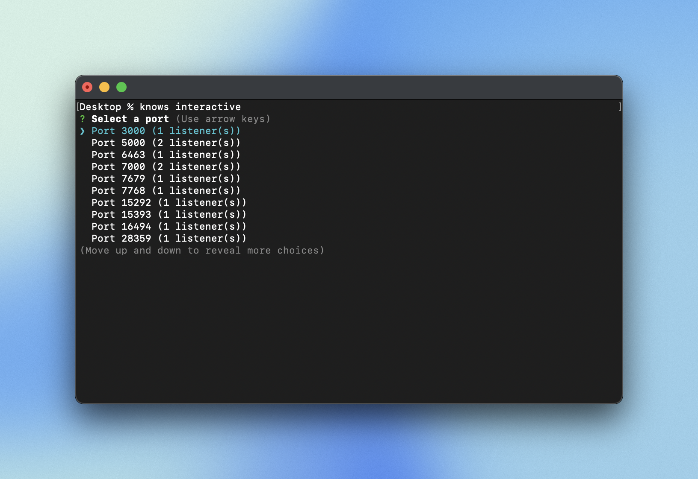
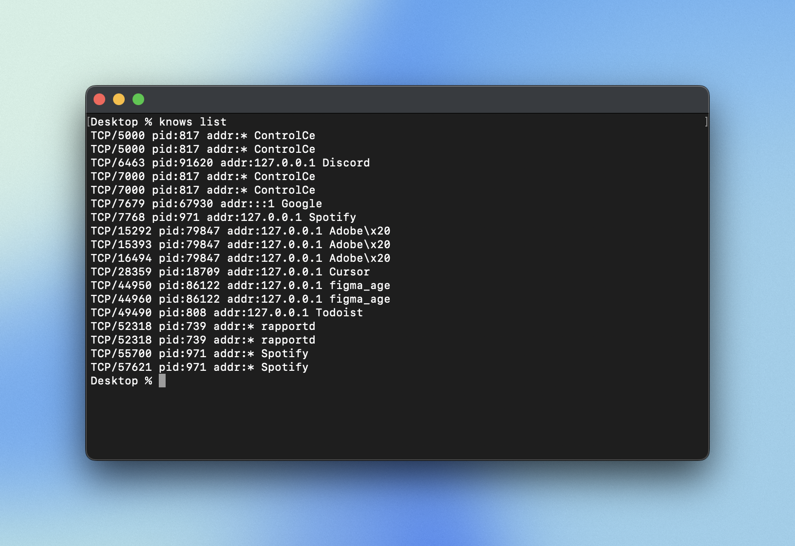

# knows

A minimal cross-platform CLI that knows what’s running — list, inspect, and kill processes easily.

## What it does

`knows` helps you discover which local processes are listening on specific ports, inspect their details, and terminate them when necessary. It supports macOS, Linux, and Windows by shelling out to familiar system tools (`lsof` or `netstat`) and enriches results so you can see the command behind each listening port. An interactive mode lets you pick ports and processes with arrow keys before choosing to inspect or kill them.

<p align="center">

</p>

## Quickstart

Install globally using npm, then run the CLI:

```bash
npm i -g knows
knows list
```

Or run it locally without installing globally:

```bash
pnpm install
pnpm run build
# optionally link the CLI
pnpm link --global
```

After linking, the `knows` command is available globally. Alternatively, run it with `pnpm exec`:

```bash
pnpm exec knows list
```

<p align="center">

</p>

## Example commands

- `knows list` – list all listening processes.
- `knows list --port 3000` – filter to port 3000.
- `knows inspect 8080` – inspect port 8080.
- `knows kill 5000` – terminate every listener on port 5000 (returns non-zero when `--force` is supplied and a process could not be killed).
- `knows watch` – monitor listening processes in real time (press `Ctrl+C` or `Ctrl+Q` to exit). Use `--port` to focus on a specific port or `--interval` to adjust the refresh rate.
- `knows interactive` – launch interactive mode with arrow-key navigation across ports and processes.

## License

This project is licensed under the MIT License - see the [LICENSE](LICENSE) file for details.
